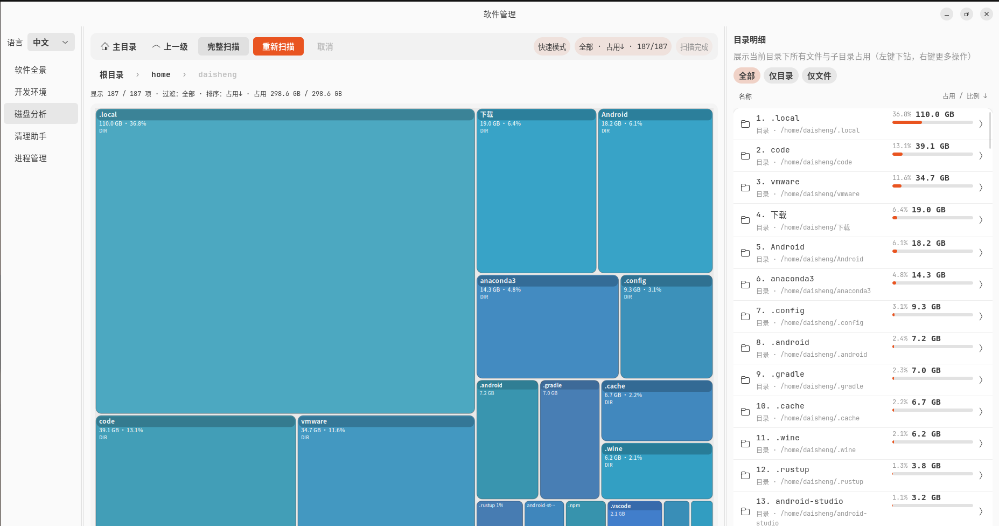

# Soft Management（`softmgr`）

Linux 系统软件与开发环境统一管理工具（原生 GUI）。它把常见软件来源（apt/snap/flatpak/桌面入口）、
开发环境（Python/Node/Rust/Java）与磁盘/缓存清理整合到一个应用里，方便快速定位“占用大、装在哪、怎么卸载”。

## 截图





## 功能

- 软件全景
  - 扫描并聚合：`apt` / `snap` / `flatpak` / `.desktop` 入口
  - 支持搜索与筛选
  - 显示卸载命令（可一键复制）
  - 支持打开安装路径（双击路径打开文件管理器）
  - 大小明细：按目录/文件统计占用（包含取消与刷新）
- 开发环境
  - 运行时：`python3`、`node`、`rustc`、`java/javac`
  - 版本管理器：`conda`、`uv`、`nvm`、`rustup`
  - 全局工具/包：`pip`、`pipx`、`uv tool`、`npm -g`、`cargo install`
- 磁盘分析
  - 快速/完整扫描（完整模式包含 `/`，更慢）
  - 目录树与可视化占用（支持打开路径与查看详情）
  - 识别常见开发缓存目录（apt/pip/npm/conda/cargo/docker 等）
- 清理助手
  - 生成清理建议并标注风险等级（apt/pip/npm/conda/cargo/docker 等）
  - 支持复制清理命令
  - 支持在应用内执行“无需 sudo”的清理项（需要 sudo 的会提示复制到终端执行）
- 进程管理
  - 展示内存/交换分区占用
  - 扫描后台进程并选择结束，释放内存（权限不足的进程可能无法结束）


## 系统要求

- Linux 桌面环境（优先面向 GNOME；基于 GTK4 + libadwaita）
- Rust 工具链：见 `rust-toolchain.toml`（当前为 `1.85`）
- 系统库（必须）
  - GTK4（建议 `>= 4.12`）
  - libadwaita（建议 `>= 1.4`）
  - `pkg-config`
- 外部命令（按功能可选，缺失会自动跳过对应模块）
  - 软件来源：`dpkg-query` / `apt`、`snap`、`flatpak`
  - 开发环境：`python3`/`pip3`/`pipx`/`uv`、`node`/`npm`、`rustc`/`cargo`/`rustup`、`java`/`javac`
  - 缓存相关：`docker`（用于识别/清理 docker 缓存）


## 下载与安装（无需编译）

项目会在 GitHub Releases 提供 Linux 预构建包（`.tar.gz`）。下载后解压并执行本地安装脚本：

```bash
tar -xzf softmgr-<版本>-linux-<架构>.tar.gz
cd softmgr-<版本>-linux-<架构>
./install-local.sh
softmgr
```

卸载：

```bash
./uninstall-local.sh
```

> 预构建包仍依赖系统已安装 GTK4 / libadwaita（见上方“系统要求”）。

也可以下载 `.deb`（Ubuntu 24.04+ 推荐），直接安装：

```bash
sudo apt install ./softmgr_<版本>_<架构>.deb
softmgr
```


## 构建与运行

### 1) 安装系统依赖（示例）

Ubuntu / Debian：

```bash
sudo apt update
sudo apt install -y build-essential pkg-config libgtk-4-dev libadwaita-1-dev
```

Fedora：

```bash
sudo dnf install -y gcc pkgconf-pkg-config gtk4-devel libadwaita-devel
```

Arch：

```bash
sudo pacman -S --needed base-devel pkgconf gtk4 libadwaita
```

### 2) 运行（开发态）

```bash
cargo run --bin softmgr
```

开启更详细日志（推荐）：

```bash
RUST_LOG=debug cargo run --bin softmgr
```

### 3) 构建（发布态）

```bash
cargo build --release
./target/release/softmgr
```

可选：本地安装到 `~/.cargo/bin`：

```bash
cargo install --path .
softmgr
```


## 日志

应用会同时输出到终端与日志文件，并按天滚动写入：

- 若设置 `XDG_STATE_HOME`：`$XDG_STATE_HOME/soft-management/`
- 否则：`$HOME/.local/state/soft-management/`
- 若上述环境变量不可用：`/tmp/soft-management/logs/`


## 开发

```bash
cargo fmt
cargo clippy
cargo test
```


## 许可协议

本项目使用 `GPL-3.0-or-later` 发布，详见 `Cargo.toml`。
